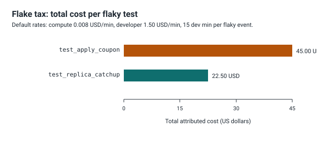

# FlakeLedger


FlakeLedger reads JUnit XML result files from many CI runs, decides which
failing tests are flakes and which are genuine failures by comparing outcomes
across reruns of the same commit, then attributes a compute cost and a
developer wait cost to each flake and ranks them. The output is a report that
names specific tests worth fixing or deleting.

Python 3.11, standard library only. No third party dependencies, no network
access.

<div align="center">

**67.5008 USD of flaky test cost across the sample runs**

Charged to two tests, `test_apply_coupon` and `test_replica_catchup`, using the
default rates. Those rates are declared inputs you should replace with your own
measurements, not universal truths.

</div>

You probably recognise the situation the tool is built for. A pull request goes
red, someone re-runs the job, it goes green, and the change merges. Nobody
recorded that the first run failed or which test caused it, and the same test
will do it again next week to somebody else. The waste is real but spread across
many people and never added up. FlakeLedger adds it up from the XML your CI
already produces, so the argument for fixing a specific test stops being a
feeling and becomes a line in a ranked table.

## How it decides what is a flake

The unit of judgement is one test on one commit, across every rerun attempt of
that commit. Because the code does not change between reruns of the same commit,
a test that both passes and fails there cannot be blaming the code: something
other than the code under test decided the outcome, which is the operational
definition FlakeLedger uses.

The four labels, and the exact rule behind each:

| Label | Rule | Meaning |
|-------|------|---------|
| flake | passed on one attempt and failed on another, same commit | outcome depends on something other than the code |
| genuine_failure | every attempt failed, same commit | the failure reproduces, so it is real |
| stable | every attempt passed or skipped, no failure | nothing to act on |
| undetermined | failed on its only attempt for that commit | one observation, no rerun to compare against |

The comparison is always within a single commit. FlakeLedger never compares a
failure on commit A against a pass on commit B and calls the difference a flake,
because the code changed between those commits, so a differing outcome is
expected. Holding the commit constant is what makes the judgement sound, and the
design decisions section explains why that boundary is the unit.

## The undetermined case and why it refuses to guess

The hard case is a test that failed and was never re-run for that commit. With a
single observation there is no second attempt to compare against, so the data
cannot distinguish a flake from a genuine failure. A tool that guessed here
would be inventing a fact it does not have.

FlakeLedger refuses to guess. By default a single failing attempt is labelled
`undetermined`, and that label is a finding in its own right: it tells you the
data is insufficient, not that the test is fine. If you want a decision anyway,
you choose the rule explicitly with `--single-fail-policy`, and the chosen
policy is printed at the top of the output so the decision is never hidden:

| Policy value | Effect on a single failing attempt |
|--------------|------------------------------------|
| `undetermined` (default) | labelled undetermined, refuses to guess |
| `genuine` | labelled genuine_failure, a conservative flake hunt |
| `flake` | labelled flake, assumes a retry would have cleared it |

The default is `undetermined` on purpose. Silently counting one red run as a
flake would inflate the cost figure with tests that may be genuinely broken;
silently counting it as genuine would hide real flakes that were simply not
re-run. Neither silent choice is honest, so the honest default is to say the
data does not decide.

## Install

```
python -m pip install -e .
```

Or run without installing by putting the sources on the path:

```
set PYTHONPATH=src
python -m FlakeLedger version
```

That prints `FlakeLedger 0.1.0` and exits clean.

## Commands

| Command | What it does |
|---------|--------------|
| `ingest` | parse JUnit XML and list every case result, one per line |
| `classify` | label each test on each commit as flake, genuine, stable, undetermined |
| `cost` | rank flaky tests by attributed cost using explicit rates |
| `version` | print the version and exit |

Run identity is read from each `testsuite`, either as `commit` and `attempt`
attributes or as `<property>` entries. Point any command at files or at a
directory of `*.xml`. A directory expands to its `*.xml` files, sorted by name;
a file is used as itself. Nonexistent paths are ignored, and if the whole input
set resolves to no XML files the command exits with a usage error rather than
crashing on a missing file.

`classify` and `cost` also accept `--single-fail-policy`. `cost` additionally
accepts the three rate flags and a `--currency` label described next.

## The cost model

Every rate is an input, not a fact. The defaults exist so a run produces
numbers, but they are placeholders for values you should measure yourself.
Nothing here is a universal truth.

| Rate flag | Default | Unit | What it means |
|-----------|---------|------|---------------|
| `--compute-rate-per-minute` | 0.008 | currency per compute minute | money cost of one CI compute minute |
| `--dev-rate-per-minute` | 1.50 | currency per developer minute | money cost of one developer minute |
| `--dev-wait-minutes-per-flaky-event` | 15.0 | developer minutes per event | time one flaky event burns while someone waits on and re-triggers a red pipeline |
| `--currency` | USD | label only | text printed next to figures, no conversion |

How to get real values: divide a CI invoice by the compute minutes it billed for
the compute rate, use a loaded engineering cost per minute for the developer
rate, and estimate the wait minutes from how long your team loses to one red
pipeline. All three are knobs; change them and every figure moves, because
nothing is hardcoded inside the formula.

Wasted compute is the flaky test's own mean runtime times the rerun attempts
beyond the first, summed over every commit where it flaked, then valued at the
compute rate. Developer wait cost is `dev-wait-minutes-per-flaky-event` minutes
per flaky event valued at the developer rate, where a flaky event is one commit
the test flaked on (two commits means two events).

The compute figure is a deliberate lower bound. It counts only the flaky test's
own runtime. In real CI a flake usually forces a rerun of a whole job, so the
true compute waste is larger than reported. FlakeLedger will not guess job
composition, because that information is not in the JUnit data, so it attributes
only the part it can measure and states plainly that the real number is higher.

## A worked run over the samples

The `samples/` directory holds hand authored JUnit fixtures spanning four
commits with reruns. The three stages below are a single run of the pipeline
over those files, ingest to classify to cost, captured verbatim.

Ingest lists every case result. Command:

```
python -m FlakeLedger ingest samples
```

```
cases 25
commits 4
commit 99aa88
commit a1b2c3
commit b7c8d9
commit d4e5f6
case 99aa88 attempt=1 tests.auth.test_login.test_valid_password passed time=0.100s
case 99aa88 attempt=1 tests.payments.test_checkout.test_apply_coupon passed time=0.790s
case 99aa88 attempt=1 tests.payments.test_checkout.test_total_with_tax passed time=0.218s
case a1b2c3 attempt=1 tests.auth.test_login.test_valid_password passed time=0.104s
case a1b2c3 attempt=1 tests.payments.test_checkout.test_apply_coupon failed time=0.812s
case a1b2c3 attempt=1 tests.payments.test_checkout.test_total_with_tax passed time=0.221s
case a1b2c3 attempt=1 tests.reports.test_export.test_pdf_header failed time=1.930s
case a1b2c3 attempt=2 tests.payments.test_checkout.test_apply_coupon passed time=0.788s
... (17 more case lines trimmed for length, 25 total; the two flaky pairs are)
case b7c8d9 attempt=1 tests.integration.test_sync.test_replica_catchup failed time=4.510s
case b7c8d9 attempt=2 tests.integration.test_sync.test_replica_catchup passed time=4.480s
case d4e5f6 attempt=1 tests.payments.test_checkout.test_apply_coupon failed time=0.905s
case d4e5f6 attempt=2 tests.payments.test_checkout.test_apply_coupon passed time=0.842s
```

Classify collapses those 25 rows into one label per test per commit. Command:

```
python -m FlakeLedger classify samples
```

```
policy single_fail=undetermined
count flake 3
count genuine_failure 2
count stable 9
class tests.auth.test_login.test_valid_password @ 99aa88 stable attempts=1 pass=1 fail=0 skip=0 (all 1 attempt(s) passed or skipped, no failures)
... (8 more stable rows trimmed for length, 9 stable total; the findings are)
class tests.integration.test_sync.test_replica_catchup @ b7c8d9 flake attempts=2 pass=1 fail=1 skip=0 (same commit produced 1 pass(es) and 1 failure(s) across 2 attempts)
class tests.payments.test_checkout.test_apply_coupon @ a1b2c3 flake attempts=2 pass=1 fail=1 skip=0 (same commit produced 1 pass(es) and 1 failure(s) across 2 attempts)
class tests.payments.test_checkout.test_apply_coupon @ d4e5f6 flake attempts=2 pass=1 fail=1 skip=0 (same commit produced 1 pass(es) and 1 failure(s) across 2 attempts)
class tests.reports.test_export.test_pdf_header @ a1b2c3 genuine_failure attempts=2 pass=0 fail=2 skip=0 (all 2 attempts failed, failure reproduces)
class tests.reports.test_export.test_pdf_header @ d4e5f6 genuine_failure attempts=2 pass=0 fail=2 skip=0 (all 2 attempts failed, failure reproduces)
```

Cost charges only the flakes and ranks them. Command:

```
python -m FlakeLedger cost samples
```

```
rates:
  compute_rate_per_minute 0.0080 USD/min
  dev_rate_per_minute 1.5000 USD/min
  dev_wait_minutes_per_flaky_event 15.00 min

ranked flaky test cost (highest first):
  1. tests.payments.test_checkout.test_apply_coupon
     events=2 wasted_compute=0.028min dev_wait=30.0min
     compute_cost=0.0002 USD dev_cost=45.0000 USD total=45.0002 USD
  2. tests.integration.test_sync.test_replica_catchup
     events=1 wasted_compute=0.075min dev_wait=15.0min
     compute_cost=0.0006 USD dev_cost=22.5000 USD total=22.5006 USD

total flaky cost 67.5008 USD
```

Follow one test through all three stages. In ingest, `test_apply_coupon` on
commit a1b2c3 is `failed` on attempt 1 (0.812s) and `passed` on attempt 2
(0.788s). In classify that commit becomes one `flake` row, because one commit
produced both a pass and a failure. In cost the coupon test carries two flaky
events (a1b2c3 and d4e5f6), charged 2 events of developer wait, 30 minutes at
1.50 USD, the 45.00 USD dominating its total.

Note that `test_replica_catchup` flaked on only one commit yet its compute waste
(0.075 min) is larger than the coupon test's (0.028 min): it runs about 4.5
seconds per attempt against under a second, so a single rerun costs more compute.
The coupon test still ranks first on total cost because it flaked on two commits,
doubling its developer wait charge. That charge dwarfs the compute charge at the
default rates, which is the model's honest shape: waiting humans cost far more
than a rerun minute.

## Reading the ranked report and what action each row should trigger

The `cost` report is ordered highest total first, so the top row costs you the
most under your rates. Read each row as a decision, not just a number:

| What you see in a row | What it means | Action it should trigger |
|-----------------------|---------------|--------------------------|
| high `dev_wait` and high `events` | the test flakes often across many commits | fix or quarantine it first, it interrupts the most people |
| high `wasted_compute` but few `events` | the test is slow and flaky, though rare | worth fixing if compute is your constraint, since one rerun is expensive |
| a test near the top you do not recognise | a costly flake nobody owns | assign an owner before it keeps taxing everyone |
| the `total flaky cost` line | the sum the flakes cost you under these rates | the size of the case for spending time on the top rows |

A `genuine_failure` is a different action: it is a real bug that reproduces, so
it belongs in the normal bug queue, not the flake queue. An `undetermined` row
means re-run that commit for a second observation before deciding anything.

## The flake tax asset

The chart below is the `cost` ranking above drawn to scale, the same two tests
and totals, built from the numbers the `cost` command printed on the samples so
it moves only if those numbers move. It is the single picture to put in front of
whoever decides where engineering time goes.



## JUnit input expectations

FlakeLedger reads the common JUnit schema produced by pytest, Gradle, Maven
Surefire, and similar tools: a `testsuites` root, or a single `testsuite`,
containing `testcase` elements. Each `testcase` carries its outcome in a child
element:

| Child element | Outcome recorded |
|---------------|------------------|
| `<failure>` or `<error>` | failed |
| `<skipped>` | skipped |
| no child element | passed |

Runtime is read from the `time` attribute in seconds. If a producer omits it,
that test contributes zero compute waste.

Run identity is not part of the base JUnit schema, so a producer must supply it.
The parser accepts two fixture styles for the `commit` and `attempt` markers,
and both are exercised by the samples.

Style one, attributes on a bare `<testsuite>` (see
`samples/run-a1b2c3-attempt1.xml`):

```
<testsuite name="payments" commit="a1b2c3" attempt="1" tests="4" failures="2">
  <testcase classname="tests.payments.test_checkout" name="test_apply_coupon" time="0.812"/>
</testsuite>
```

Style two, `<property>` entries inside a `<testsuites>` wrapper (see
`samples/run-99aa88-attempt1.xml`):

```
<testsuites>
  <testsuite name="payments" tests="3" failures="0">
    <properties>
      <property name="commit" value="99aa88"/>
      <property name="attempt" value="1"/>
    </properties>
  </testsuite>
</testsuites>
```

When both markers are absent, FlakeLedger falls back to documented defaults
(`commit=unknown-commit`, `attempt=1`) and records a warning rather than
guessing silently. The `attempt` value defaults to 1 for the first run and rises
for each rerun of the same commit.

## Output format

All output is line oriented plain text so two runs diff cleanly in git. The
fields per command are a contract:

| Command | Field | Meaning |
|---------|-------|---------|
| ingest | `case <commit>` | the commit the run was for |
| ingest | `attempt=<n>` | the rerun index, 1 for the first run |
| ingest | `<test_id>` | classname joined to name, the stable identifier |
| ingest | `<status>` | passed, failed, or skipped |
| ingest | `time=<s>s` | runtime in seconds, three decimal places |
| classify | `class <test_id> @ <commit>` | the test and commit judged |
| classify | `<label>` | flake, genuine_failure, stable, or undetermined |
| classify | `attempts=<n>` | how many rerun attempts were seen |
| classify | `pass= fail= skip=` | outcome counts across those attempts |
| classify | `(<reason>)` | the plain language rule that produced the label |
| cost | `events=<n>` | commits where the test flaked |
| cost | `wasted_compute=<m>min` | summed rerun runtime attributed as waste |
| cost | `dev_wait=<m>min` | summed developer wait minutes |
| cost | `compute_cost` | wasted compute valued at the compute rate |
| cost | `dev_cost` | developer wait valued at the developer rate |
| cost | `total` | the sum of the two, the ranking key |

## Exit codes

| Code | Meaning |
|------|---------|
| 0 | clean, no findings |
| 1 | findings present (a flake, a genuine failure, or an undetermined case) |
| 2 | usage error, such as no XML files found in the given inputs |

`version` and `ingest` always exit 0 on success. `classify` exits 1 when any
flake, genuine failure, or undetermined case exists. `cost` exits 1 when at
least one test was charged. This makes the tool usable as a CI gate.

## Using it in CI

Add a step after your test runs that points `cost` (or `classify`) at the
directory of collected JUnit XML. A non-zero exit fails the step, which is how
you turn a growing flake bill into something the pipeline notices:

```
set PYTHONPATH=src
python -m FlakeLedger cost path/to/junit-xml
```

Because the output is deterministic and line oriented, you can commit a report
and diff two runs to see whether a flake was fixed or a new one appeared. Sort
order is stable (by total cost then test id for `cost`, by test id then commit
for `classify`), so a diff shows only real changes, not reordering noise.

## Limitations

The honest limits of the tool, kept and expanded:

- The cost is an estimate built on declared rates, not a measurement of money
  that left an account. Every figure is only as good as the three rates you
  supply, and the defaults are placeholders, not your real costs. Treat the
  total as the output of a model whose inputs you own.
- The compute figure counts only the flaky test's own runtime. In real CI a
  flake usually forces a rerun of a whole job, so the true compute waste is
  larger than reported. This is a deliberate lower bound, because job
  composition is not in the JUnit data and FlakeLedger will not guess it.
- The developer wait figure is a flat per event estimate, not a measurement of
  any real person's time. Treat it as a knob, not a fact.
- Runtimes come from the `time` attribute in the XML. If a producer omits it,
  that test contributes zero compute waste, which understates the cost of slow
  flakes that do not report timing.
- It does not run your tests or trigger reruns. It reads XML that already
  exists.
- It does not detect flakes within a single attempt. It needs at least two
  attempts of the same commit to see a differing outcome, which is why the
  single failing attempt is undetermined by default.
- It does not model whole job rerun cost, cross test interference, or queueing
  delay.
- It does not read vendor specific fields beyond the common JUnit schema plus
  the `commit` and `attempt` markers.

## Design decisions

The reasoning behind the choices that shaped the tool, including the alternative
that was rejected.

Same commit reruns are the unit of judgement. The alternative was to compare a
test's outcome across different commits: if it passed on Monday and failed on
Tuesday, call it flaky. That was rejected because the code changed between those
commits, so a differing outcome is expected and proves nothing about
nondeterminism. Holding the commit constant is the only way to isolate flakiness
from real regressions, so the commit boundary is the unit and the tool never
crosses it.

Undetermined is the default for a single failing attempt. The alternative was to
pick a side automatically, either assuming a retry would have passed (flake) or
assuming the failure was real (genuine). Both were rejected as dishonest
defaults: with one observation the data genuinely does not decide, and silently
choosing either way would either inflate the flake bill with broken tests or
bury real flakes. Surfacing `undetermined` as its own finding tells the user to
gather a second observation, which is the correct next step, and the policy flag
still lets a team opt into a side deliberately with the choice printed.

Output is line oriented plain text, not JSON or a rich table. The alternative
was structured output for machine parsing. Plain deterministic lines were chosen
because the primary consumer is a human reading a git diff between two runs, and
stable one record per line output makes that diff meaningful. A structured
format can be layered on later without changing this decision.

## Repository layout

```
FlakeLedger/
  README.md                     this file
  CHANGELOG.md                  version history
  LICENSE                       MIT license
  pyproject.toml                package metadata and the FlakeLedger entry point
  .gitignore                    ignored paths
  docs/
    assets/
      logo.svg                  the wordmark with the flake signature mark
      flake-tax.svg             the ranked cost chart drawn from the sample run
  samples/
    README.md                   what each fixture proves and its expected labels
    run-a1b2c3-attempt{1,2}.xml  commit a1b2c3 run twice, attribute style
    run-d4e5f6-attempt{1,2}.xml  commit d4e5f6 run twice
    run-b7c8d9-attempt{1,2}.xml  commit b7c8d9 run twice, the slow flake
    run-99aa88-attempt1.xml     commit 99aa88, single green run, property style
  src/
    FlakeLedger/
      __init__.py               package marker and version string
      __main__.py               entry point for python -m FlakeLedger
      cli.py                    argument parsing, subcommands, exit codes
      junit.py                  JUnit XML parsing into case results
      runs.py                   grouping of case results by test and commit
      classify.py               labelling into flake, genuine, stable, undetermined
      cost.py                   the cost model and per test ranking
      report.py                 line oriented deterministic rendering
  tests/
    test_junit.py               parser tests, both fixture styles and timing
    test_classify.py            classification and single fail policy tests
    test_cost.py                cost model, ranking, and CLI exit code tests
```

## Glossary

| Term | Meaning in this tool |
|------|----------------------|
| attempt | one rerun of a commit, numbered from 1 |
| commit | the source revision under test, the boundary for judgement |
| test_id | classname joined to name, the identity that groups reruns |
| flake | a test that both passed and failed on one commit's reruns |
| genuine failure | a test that failed on every attempt of a commit |
| undetermined | a single failing attempt, no rerun to compare against |
| flaky event | one commit on which a given test flaked, the unit of dev wait |
| wasted compute | rerun runtime beyond the first attempt, attributed to a flake |
| rate | an input price you supply, not a value the tool measures |

## Verification

The test suite is standard library `unittest`, no third party runner. Run it
from the project root:

```
set PYTHONPATH=src
python -m unittest discover -s tests -v
```

The last captured run reported 22 tests passing:

```
----------------------------------------------------------------------
Ran 22 tests in 0.017s

OK
```

The 0.017s figure is from an unspecified machine and is indicative of the suite
being small and pure, not a benchmark. Coverage: `test_junit.py` checks both
fixture styles, status detection, `time` parsing, and that many files parse
sorted and complete at 25 rows; `test_classify.py` checks each label from the
samples, all three single fail policies, rejection of an unknown policy, and
sorted output; `test_cost.py` checks that only flakes are charged, a hand
checked cost calculation for the coupon test, descending rank order, and every
CLI exit code.

## Roadmap

Possible directions, without dates or promises:

- An optional structured output mode for machine consumption, layered on top of
  the plain text without replacing it.
- Attributing whole job rerun cost when a job to test mapping is supplied,
  lifting the compute figure above its current lower bound.
- A diff subcommand that compares two runs directly instead of relying on a git
  diff of committed reports.

## License

MIT. See [LICENSE](LICENSE).

# draft note 2
